# Supported Diagram Types

The pgavlin/mermaid-ascii fork supports 22 Mermaid diagram types.
The original AlexanderGrooff/mermaid-ascii supports only flowchart and sequence.

## Flowchart

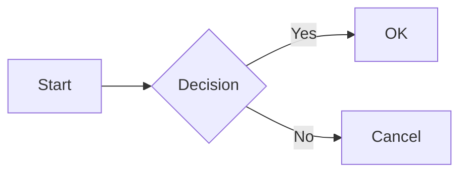

## Sequence Diagram

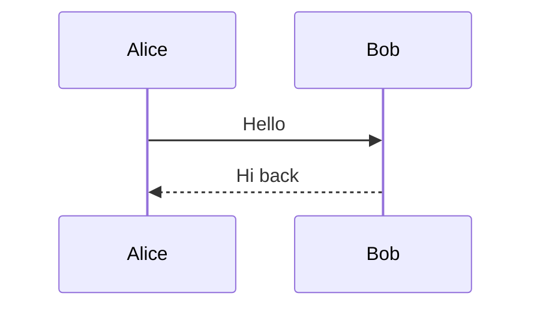

## Class Diagram

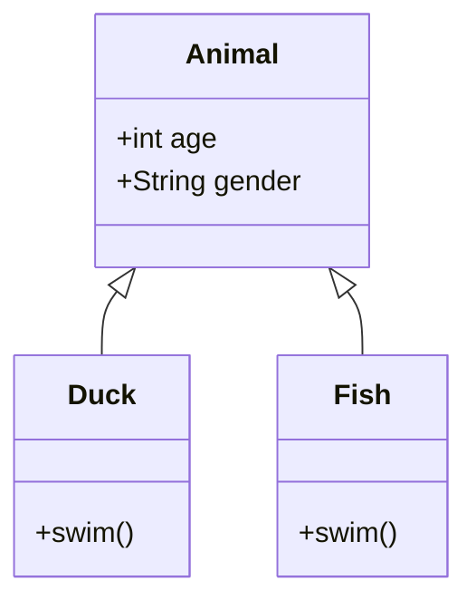

## State Diagram

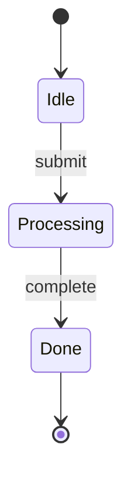

## Entity Relationship Diagram

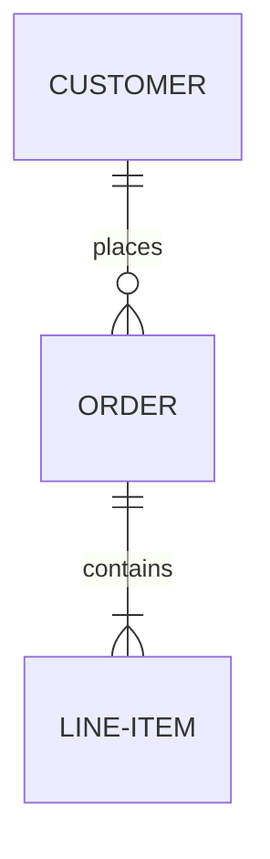

## Gantt Chart

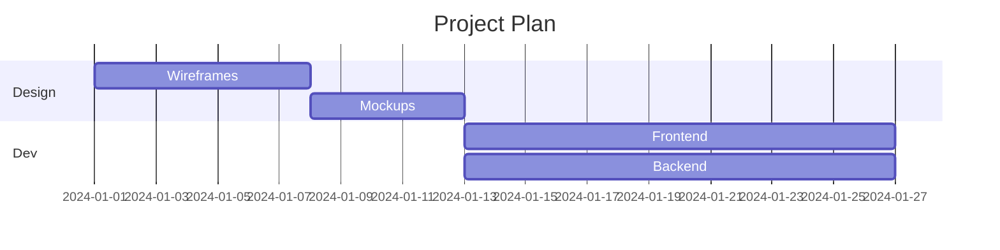

## Pie Chart

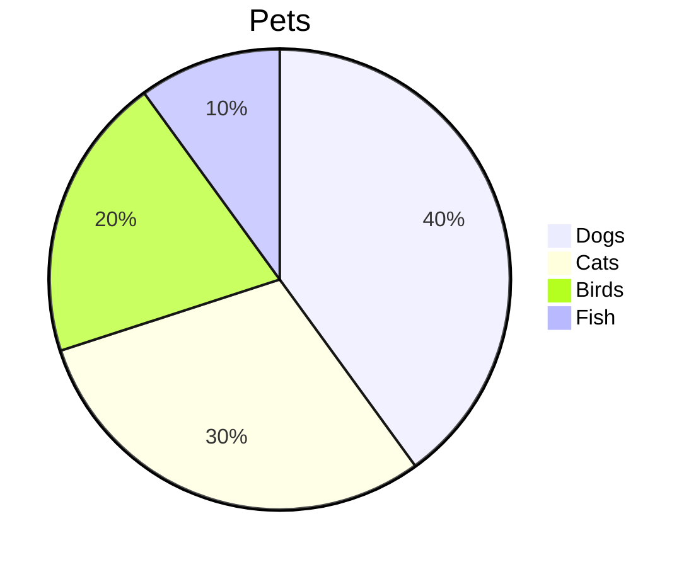

## Mindmap

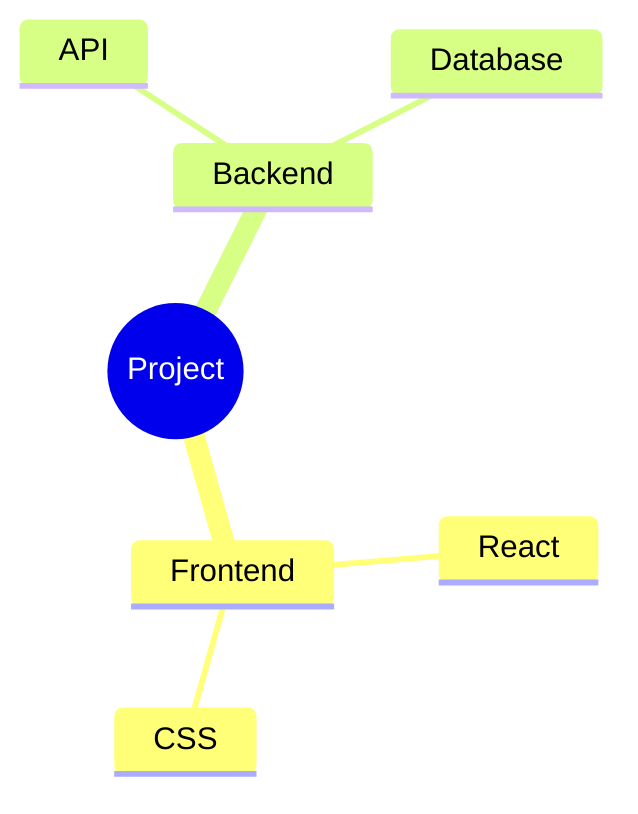

## Timeline

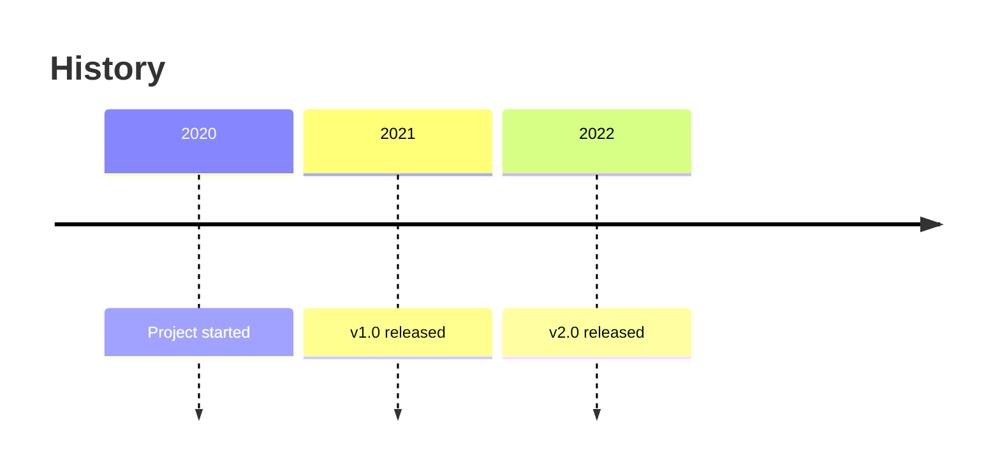

## Git Graph

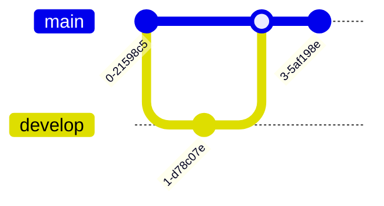

## User Journey

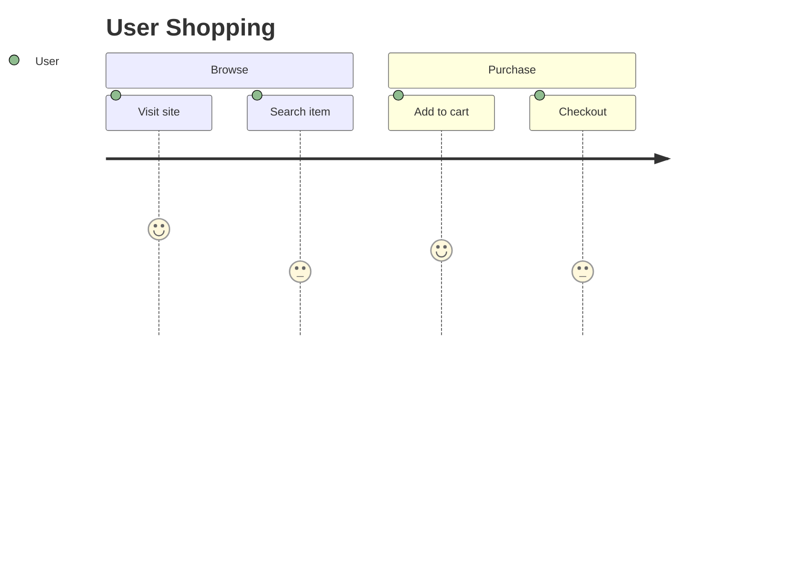

## Quadrant Chart

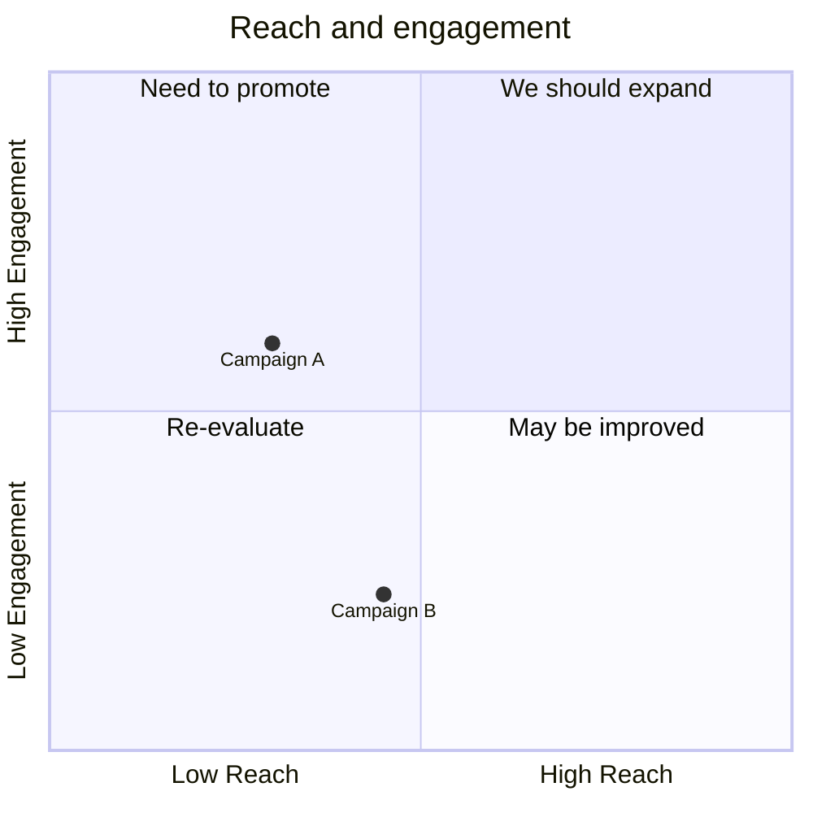

## XY Chart

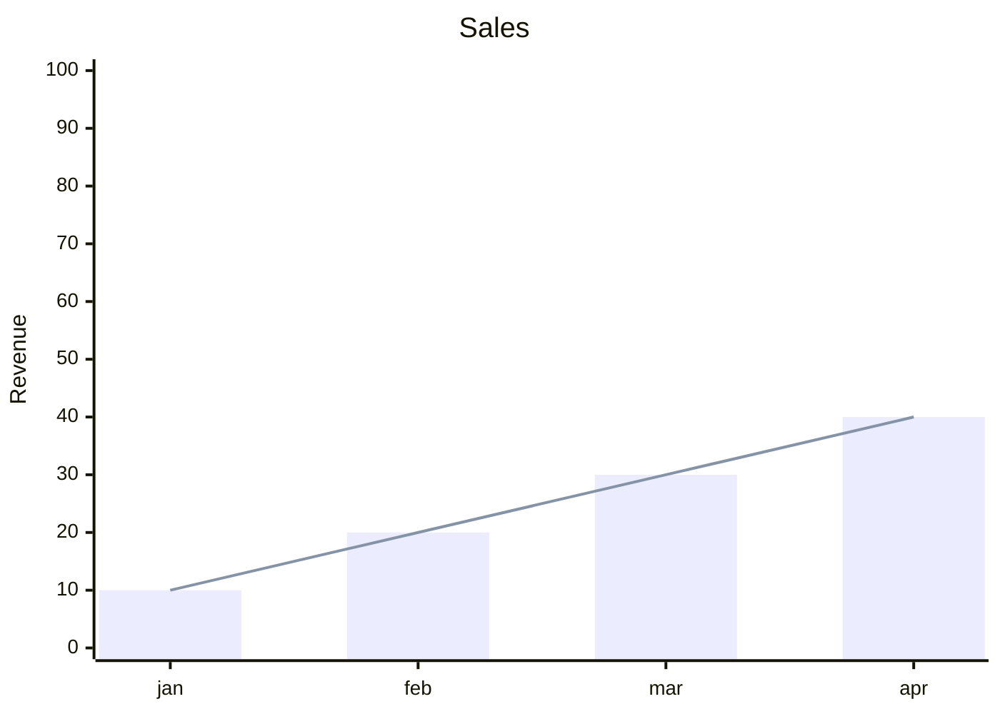

## C4 Diagram

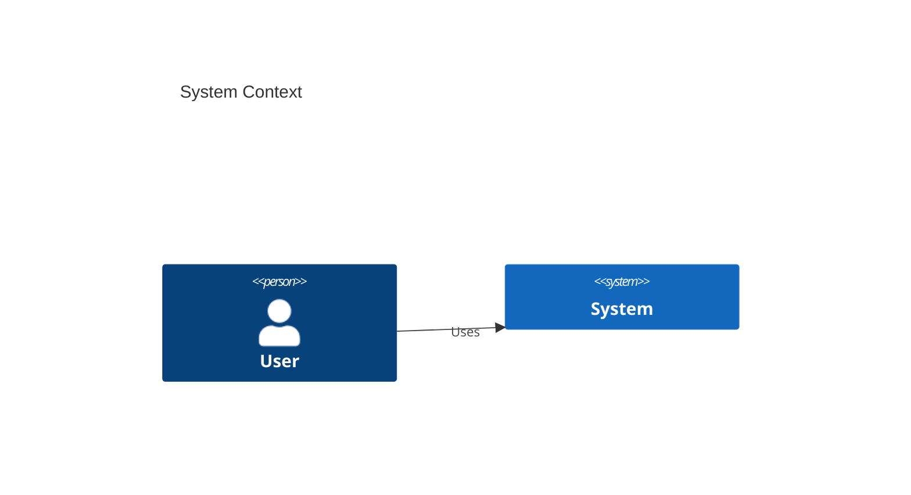

## Requirement Diagram

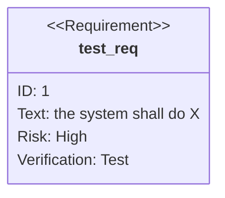

## Block Diagram

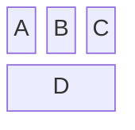

## Sankey Diagram

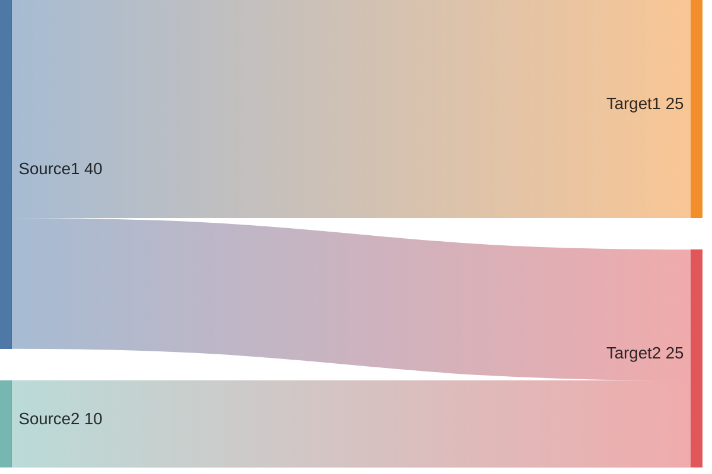

## Packet Diagram

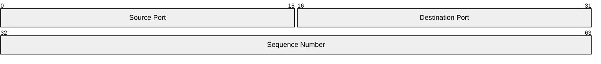

## Kanban

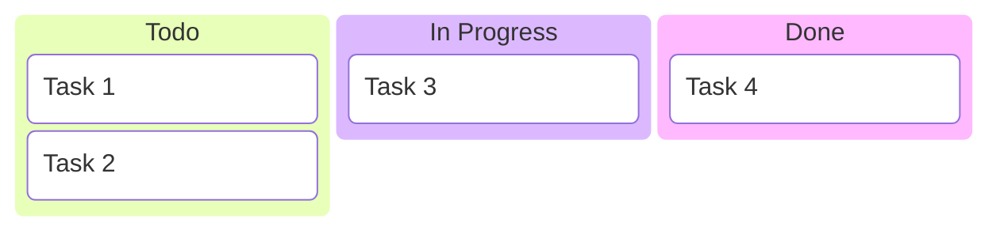

## Architecture Diagram

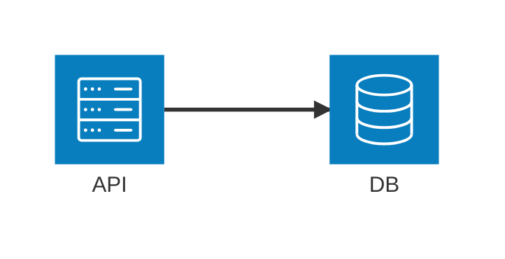

## ZenUML

```mermaid
zenuml
    Alice->Bob: request
    Bob->Alice: response
```
